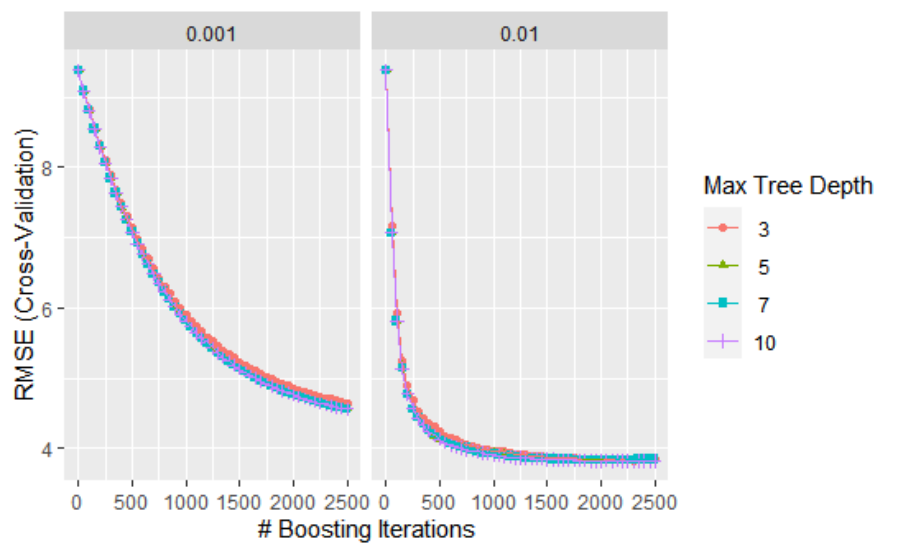
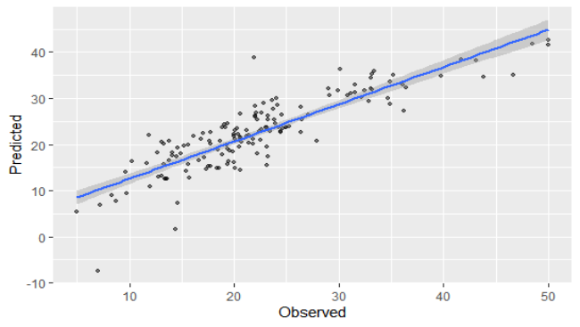

# Report
# 1.Introduction
## (1)Problem Description
The target of the task is to construct a predictive Gradient Boosting Machine (GBM) model of house prices using the Boston House dataset.
Boston House dataset is the Housing data for 506 census tracts of Boston from the 1970 census. The dataframe BostonHousing in R contains the original data by Harrison and Rubinfeld (1979). The original data are 506 observations on 14 variables, medv being the target variable:

| crim    | per capita crime rate by town                                |
| ------- | ------------------------------------------------------------ |
| zn      | proportion of residential land zoned for lots over 25        |
| indus   | proportion of non-retail business acres per town             |
| chas    | Charles River dummy variable (= 1 if tract bounds river; 0 otherwise) |
| nox     | nitric oxides concentration (parts per 10 million)           |
| rm      | average number of rooms per dwelling                         |
| age     | proportion of owner-occupied units built prior to 1940       |
| dis     | weighted distances to five Boston employment centres         |
| rad     | index of accessibility to radial highways                    |
| tax     | full-value property-tax rate per USD 10                      |
| ptratio | pupil-teacher ratio by town                                  |
| b       | 1000(B - 0.63)^2 where B is the proportion of blacks by town |
| lstat   | percentage of lower status of the population                 |
| medv    | median value of owner-occupied homes in USD 1000's           |


As a result, more precisely, the problem of the task is to predict the variable “medv” using the other 13 variables in Boston House dataset. We can use all 13 variables or select several variables when fitting the Gradient Boosting Machine (GBM) model.
## (2)Study Aim
However, the study aim is not to get the result of the prediction using the GBM model. The key thing is the discussion of the result and methods which means we are learning how to construct a predictive Machine Learning model (like GBM model) . We must critically think and understand every step in the process of constructing the GBM model. We have to know the limitations and advantages of the Machine Learning method and the techniques from the ML practical we used. In a word, we have to focus on the machine learning not the house prices.
## (3)The advantages of GBM
The Gradient boosted machine (GBM) approach is a forward learning ensemble tree-based method and an extremely popular machine learning algorithm that have proven successful across many domains.The advantages of GBM are obvious.The GBM approach often provides predictive accuracy that cannot be beat. The GBM has Lots of flexibility because it can optimize on different loss functions and provides several hyper-parameter tuning options that make the function fit very flexible. The GBM often works great with categorical and numerical values as is and has ability to handle the missing data so that the imputation is not required.

# 2.Methods
## (1)Data Description
The first step of training a Machine Learning model is to observe and explore the original data. The quality of data often determines the success or failure of the model. The Boston House dataset are 506 observations on 14 variables, medv being the target variable.Here is the first 5 lines of data.
	crim	zn	indus	chas	nox	rm	age	dis	rad	tax	ptratio	b	lstat	medv
1	0.00632	18	2.31	0	0.538	6.575	65.2	4.09	1	296	15.3	396.9	4.98	24
2	0.02731	0	7.07	0	0.469	6.421	78.9	4.9671	2	242	17.8	396.9	9.14	21.6
3	0.02729	0	7.07	0	0.469	7.185	61.1	4.9671	2	242	17.8	392.83	4.03	34.7
4	0.03237	0	2.18	0	0.458	6.998	45.8	6.0622	3	222	18.7	394.63	2.94	33.4
5	0.06905	0	2.18	0	0.458	7.147	54.2	6.0622	3	222	18.7	396.9	5.33	36.2
We can use the “summary” function in R to observe the characteristics of the data.
       crim             zn            indus        chas         nox        
 Min.   : 0.00632   Min.   :  0.00   Min.   : 0.46   0:471   Min.   :0.3850  
 1st Qu.: 0.08205   1st Qu.:  0.00   1st Qu.: 5.19   1: 35   1st Qu.:0.4490  
 Median : 0.25651   Median :  0.00   Median : 9.69           Median :0.5380  
 Mean   : 3.61352   Mean   : 11.36   Mean   :11.14           Mean   :0.5547  
 3rd Qu.: 3.67708   3rd Qu.: 12.50   3rd Qu.:18.10           3rd Qu.:0.6240  
 Max.   :88.97620   Max.   :100.00   Max.   :27.74           Max.   :0.8710  
       rm             age              dis              rad              tax       
 Min.   :3.561   Min.   :  2.90   Min.   : 1.130   Min.   : 1.000   Min.   :187.0  
 1st Qu.:5.886   1st Qu.: 45.02   1st Qu.: 2.100   1st Qu.: 4.000   1st Qu.:279.0  
 Median :6.208   Median : 77.50   Median : 3.207   Median : 5.000   Median :330.0  
 Mean   :6.285   Mean   : 68.57   Mean   : 3.795   Mean   : 9.549   Mean   :408.2  
 3rd Qu.:6.623   3rd Qu.: 94.08   3rd Qu.: 5.188   3rd Qu.:24.000   3rd Qu.:666.0  
 Max.   :8.780   Max.   :100.00   Max.   :12.127   Max.   :24.000   Max.   :711.0  
    ptratio            b              lstat            medv      
 Min.   :12.60   Min.   :  0.32   Min.   : 1.73   Min.   : 5.00  
 1st Qu.:17.40   1st Qu.:375.38   1st Qu.: 6.95   1st Qu.:17.02  
 Median :19.05   Median :391.44   Median :11.36   Median :21.20  
 Mean   :18.46   Mean   :356.67   Mean   :12.65   Mean   :22.53  
 3rd Qu.:20.20   3rd Qu.:396.23   3rd Qu.:16.95   3rd Qu.:25.00  
`Max.   :22.00   Max.   :396.90   Max.   :37.97   Max.   :50.00  

As we can see from the above result, most variable including the response variable “medv” is numeric and continuous. The “chas” variable is Charles River dummy variable (= 1 if tract bounds river; 0 otherwise). The GBM model can deal with both categorical and numerical values so we don’t have to change anything about the type of variables. Meanwhile, there are no missing values to process.
The scales of variables are not the same so we have to re-scale the variables except the response variable “medv”.
## (2)Data Process
We have to split the data into training and validation subset. The “createDataPartition” function can be used to create training and testing (validation) subsets. Generally, the size of training subset should be larger than the test subset.We can make the training subset contains the 70% samples. 
We have to make sure the distributions of the target variable are similar across the 2 splits.
train subset:   Min. 1st Qu.  Median    Mean 3rd Qu.    Max. 
                5.00   17.02   21.20   22.58   25.00   50.00 
test subset:    Min. 1st Qu.  Median    Mean 3rd Qu.    Max. 
            5.00   17.02   21.20   22.41   25.00   50.00 
After splitting the dataset into training and validation subset, the predictor variables should be re-scaled to z-scores in each subset.
Since we don’t know the importance of variables at the beginning, all 13 variables can be used to train the GBM model. The tree-based model can extract useful variables so the variable selection may has small effect on the performance of model.

# 3.Results
## (1)GBM
The Gradient boosted machine (GBM) approach is a forward learning ensemble tree-based method.Whereas random forests build an ensemble of deep independent trees, GBM builds an ensemble of shallow and weak successive trees with each tree learning and improving on the previous. When combined, these many weak successive trees produce a powerful “committee” that are often hard to beat with other algorithms. Boosting is a framework that iteratively improves any weak learning model. Many gradient boosting applications allow you to “plug in” various classes of weak learners at your disposal. In practice however, boosted algorithms almost always use decision trees as the base-learner.Gradient boosting is considered a gradient descent algorithm. Gradient descent is a very generic optimization algorithm capable of finding optimal solutions to a wide range of problems.Gradient descent can be performed on any loss function that is differentiable. Consequently, this allows GBMs to optimize different loss functions as desired.
Part of the beauty and challenges of GBM is that they offer several tuning parameters. The beauty in this is GBMs are highly flexible. The challenge is that they can be time consuming to tune and find the optimal combination of hyperparamters. 
It takes a number of parameters that can be adjusted or tuned.
Parameters	Lables	Meanings
n.trees	# Boosting Iterations 	Integer specifying the total number of trees to fit. This is equivalent to the number of iterations and the number of basis functions in the additive expansion. Default is 100.
interaction.depth	Max Tree Depth 	Integer specifying the maximum depth of each tree (i.e., the highest level of variable interactions allowed). A value of 1 implies an additive model, a value of 2 implies a model with up to 2-way interactions, etc. Default is 1.
shrinkage	Shrinkage 	a shrinkage parameter applied to each tree in the expansion. Also known as the learning rate or step-size reduction; 0.001 to 0.1 usually work, but a smaller learning rate typically requires more trees. Default is 0.1.
n.minobsinnode	Min. Terminal Node Size	Integer specifying the minimum number of observations in the terminal nodes of the trees. Note that this is the actual number of observations, not the total weight.
The number of explanatory variables is 13, so we should set the the maximum depth of each tree less than 13 like 3,5,7,10. The  total number of trees can be hundreds or thousands. The learning rate usually is small like 0.001,0.01.
We can set the tuning grid as follows.
caretGrid  <-  expand.grid(interaction.depth=c(3,5,7,10),  n.trees= (0:50)*50,
shrinkage=c(0.01 ,0.001),
n.minobsinnode=20)
The metric is “RMSE” which means the loss function is “RMSE” and the GBM model is trained by minimizing the loss.
5 fold cross validation is used to find the optimal number of trees that minimize the loss function. 
## (2)Tuning results
The model can be trained over the grid on the training subset.



The loss becomes smaller and smaller as the boosting iterations becomes bigger. We can say that the model is trained well if the value of loss(i.e. RMSE) stays at the same low level.
When the learning rate is 0.01, the loss decreased quickly and stayed in a low level so the model is well-trained. When the learning rate is 0.001, the loss is still decreasing while the iterations reached the maximum iterations so the model is not trained well. 
From the practical, we know that we should set the maximum iterations bigger when the learning rate is smaller.
Meanwhile, the loss is smaller as the max depth of tree is bigger.
## (3)Evaluation
The metric is “RMSE” which means we can use the RMSE to evaluate the GBM model.
The model is trained on the training date set while the model is evaluated on the test data set. After running the grid, we can get the best model which has the minimum RMSE.
Parameters	Value
n.trees	2500
interaction.depth	10
shrinkage	0.01
n.minobsinnode	20
This final model can be evaluated by predicting the “medv” on the test subset.



The metrics can be more than RMSE.
Metrics 	Train set	Test set
RMSE  	3.821521	3.0967685
Rsquared       	0.8437278	0.8750112 
MAE 	2.727679	2.1887494 
The performance is better when RMSE or MAE is smaller and R-squared is larger. The metrics on training set and test set are similar which means the model is not over-fitting.
GBM V.S. OLS
The metrics on the test set for the final GBM model and OLS.
Metrics 	GBM	OLS
RMSE  	3.0967685	4.3622594 
Rsquared       	0.8750112 	0.7503649 
MAE 	2.1887494 	3.2563559 
As we can see, the performance of the GBM is better than the OLS. The GBM is a good model.
# 4.Discussion
The GBM model has lots of advantages.The GBM approach provides predictive accuracy that OLS method cannot be beat. The GBM has Lots of flexibility because it can optimize on different loss functions and provides several hyper-parameter tuning options that make the function fit very flexible. 
On the other hand, the GBM has disadvantages. GBM will continue improving to minimize all errors. This can overemphasize outliers and cause overfitting.The cross-validation must used to neutralize. GBM often require many trees (>1000) which can be time and memory exhaustive.The high flexibility results in many parameters that interact and influence heavily the behavior of the approach (number of iterations, tree depth, regularization parameters, etc.). This requires a large grid search during tuning.The GBM is less interpretable although this is easily addressed with various tools (variable importance, partial dependence plots, LIME, etc.).
The importance of the variables are as follows.
lstat	425545.053   
rm	279949.860   
dis	83171.683   
crim	56647.201   
nox	46179.510   
b	34830.516   
age	29590.936   
ptratio	23651.265   
tax	16556.736   
indus	9424.335 
rad	8598.926   
zn	1522.387   
chas1	0.000 
We can choose the most important several variables if the number of variables are large.
# 5.References
Chapter 7 in Comber and Brunsdon (2021). Geographical data science and spatial data analysis: an introduction in R, Sage, London: https://leeds.primo.exlibrisgroup.com/permalink/44LEE_INST/13rlbcs/alma991019706049405181 
The caret package: http://topepo.github.io/caret/index.html 
Bradley Boehmke & Brandon Greenwell (2020). Hands-On Machine Learning with R, https://bradleyboehmke.github.io/HOML/
Breiman, L., 2001. Statistical modeling: The two cultures (with comments and a rejoinder by the author). Statistical science, 16(3), pp.199-231 - https://projecteuclid.org/download/pdf_1/euclid.ss/1009213726 
Mullainathan, S. and Spiess, J., 2017. Machine learning: an applied econometric approach. Journal of Economic Perspectives, 31(2), pp.87-106. https://pubs.aeaweb.org/doi/pdfplus/10.1257/jep.31.2.87 
Dzyabura, D. and Yoganarasimhan, H., 2018. Machine learning and marketing. In Handbook of Marketing Analytics. Edward Elgar Publishing. https://faculty.washington.edu/hemay/ml-marketing.pdf 
Miller, H.J. and Goodchild, M.F., 2015. Data-driven geography. GeoJournal, 80(4), pp.449-461.
https://bookdown.org/martin_monkman/DataScienceResources_book/ml.html 

# 6.Codes

## The code for GBM model of house price (medv) using the BostonHousing data

Load the libraries and the BostonHousing data.

```{r}
library(caret)
library(gbm)
library(tidyverse)
library(mlbench)

data(BostonHousing)
head(BostonHousing)
```
Split the data into training and testing (validation) subsets using the createDataPartition function;

```{r}
set.seed(1234) # set the seed

train.index = createDataPartition(BostonHousing$medv,p=0.7,list=F)
data.train = BostonHousing[train.index,]
data.test = BostonHousing[-train.index,]
```
The distributions of the target variable are similar across the 2 splits:

```{r}
summary(data.train$medv)
summary(data.test$medv)
```

Rescale the training and validation subsets, and keep the target variable in its original form.

```{r}
data.train.z =
data.train %>% select(-medv)  %>%
mutate_if(is_logical,as.character)  %>%
mutate_if(is_double,scale)  %>%   data.frame()
data.test.z  =
data.test  %>% select(-medv)  %>%
mutate_if(is_logical,as.character)  %>%
mutate_if(is_double,scale)  %>%   data.frame()
#  add unscaled  y variable  back
data.train.z$medv = data.train$medv
data.test.z$medv = data.test$medv
```

GBM model

```{r}
modelLookup("gbm")
```
A tuning grid can be set for these, and evaluation metric defined:
```{r}
caretGrid  <-  expand.grid(interaction.depth=c(3,5,7,10),  n.trees= (0:50)*50,
shrinkage=c(0.01 ,0.001),
n.minobsinnode=20)
metric  <-"RMSE"

trainControl<- trainControl (method="cv" , number=5)
```
Then the model can be run over the grid, setting a seed for reproducibility:

```{r}
set.seed(99)
gbm.caret  <-  train(medv ~.,data=data.train.z,  distribution="gaussian" , method="gbm" ,
trControl=trainControl, verbose=FALSE ,
tuneGrid=caretGrid, metric=metric)
```

explore  the  results
```{r}
print (gbm.caret)
ggplot(gbm.caret)
```
```{r}
names (gbm.caret)
```
```{r}
# see  best  tune
gbm.caret[6]
```

```{r}
# see  grid  results
head(data.frame(gbm.caret[4]))
dim(caretGrid)
dim(data.frame(gbm.caret[4]))
```
Find  the  best parameter  COmbinatiOn
```{r}
#put  into  a  data.frame
grid_df = data.frame(gbm.caret[4])
grid_df[which.min(grid_df$results.RMSE),]
```
```{r}
# assign  to  params  ana  inspect
params  =  grid_df[which.min(grid_df$results.RMSE),  1:4]
params
```
These can be used in the final model:
```{r}
##  Create  final  mOdel
# because  parameters  are  known,  model  can  be  fit  without  parameter  tuning
fitControl  <-  trainControl (method  = "none" ,  classProbs=FALSE)
# extract the values  from  params
gbmFit  <-  train(medv~ .,  data=data.train.z,  distribution="gaussian" , method= "gbm", trControl  =  fitControl,verbose = FALSE ,
##  Only  a  single  model  is  passed  to  the
tuneGrid  =  data.frame(interaction.depth = 10 ,
n.trees =  2500 ,
shrinkage =  0.01 ,
n.minobsinnode =  20),
metric = metric)

##  Prediction  and  model  evaluation
# generate  predictions
pred= predict(gbmFit, newdata  =data.test.z)
# plot  these  against  observed
data.frame(Predicted  =  pred,  Observed  =  data.test.z$medv)  %>%
ggplot(aes(x =Observed, y = Predicted))+  geom_point (size =1,  alpha = 0.5)+geom_smooth(method ="lm")
```

```{r}
# generate  some  prediction  accuracy  measures
postResample (pred= pred,  obs=data.test.z$medv)

# examine  variable  importance
varImp(gbmFit, scale  =  FALSE)

```
compare with the OLS:
```{r}
##  Create  final  mOdel
# because  parameters  are  known,  model  can  be  fit  without  parameter  tuning
fitControl  <-  trainControl (method  = "none" ,  classProbs=FALSE)
# extract the values  from  params
OLSFit  <-  train(medv~ .,  data=data.train.z,  distribution="gaussian" , method= "lm", trControl  =  fitControl,verbose = FALSE ,
metric = metric)

##  Prediction  and  model  evaluation
# generate  predictions
pred_OLS= predict(OLSFit, newdata  =data.test.z)
postResample (pred= pred_OLS,  obs=data.test.z$medv)
```
## plot  these  against  observed
data.frame(Predicted  =  pred_OLS,  Observed  =  data.test.z$medv)  %>%
ggplot(aes(x =Observed, y = Predicted))+  geom_point (size =1,  alpha = 0.5)+geom_smooth(method ="lm")

